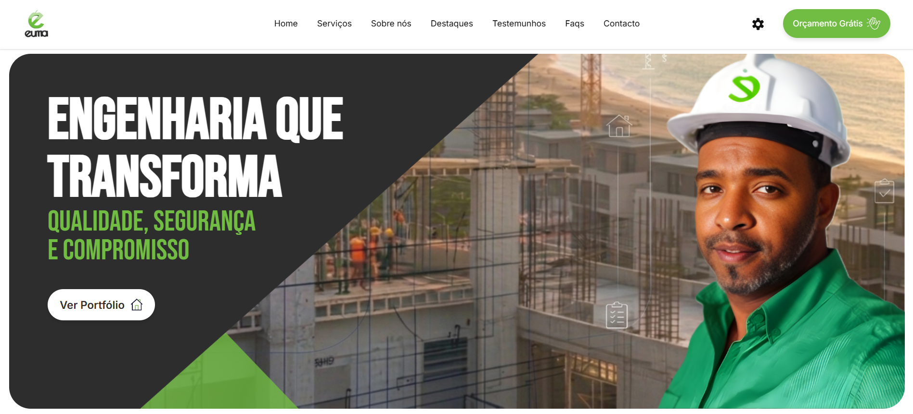
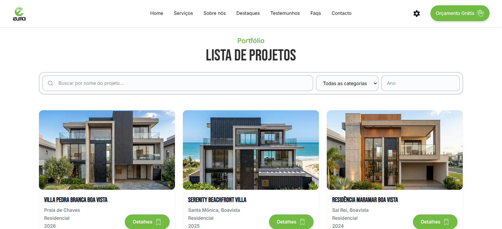

<h1 align="center">🏗️ EUMA - Construção e Engenharia, Lda </h1>

<p align="center">

</p>

Repositório do website oficial e sistema de gestão de portfólio da **EUMA - Construção e Engenharia, Lda**. Uma plataforma robusta desenvolvida para apresentar projetos de engenharia civil, oferecendo uma experiência interativa e profissional aos clientes.

## 🚀 Sobre o Projeto

O website funciona como um portfólio digital dinâmico. Ele permite que a empresa catalogue seus projetos por categorias, exiba localizações exatas via Google Maps e receba contatos diretos de novos clientes interessados.

### Principais Funcionalidades:
* **Catálogo de Projetos:** Listagem organizada (Residencial, Comercial e Hotelaria).
* **Geolocalização Inteligente:** Integração com **Google Maps API** para exibir a localização de cada imóvel e da sede da empresa.
* **Painel Administrativo (CMS):** Sistema privado para criar, editar e excluir projetos (CRUD completo).
* **Gestão de Media:** Upload de múltiplas imagens por projeto via **Multer**.
* **Lead Generation:** Formulário de contacto integrado com redirecionamento automático para **WhatsApp**.
* **Design Premium:** Interface responsiva e moderna focada na credibilidade da engenharia e logo da empresa.

## 📸 Screenshots

### Página Inicial


### Lista de Projetos


### Projeto Singular


### Painel Admin


## 📂 Estrutura de Ficheiros

```text
euma_construtora/
├── README.md
│
├── frontend/
│     │
│     ├── src/
│     │    ├── assets/
│     │    ├── components/
│     │    ├── pages/
│     │    ├── routes/
│     │    ├── services/
│     │    ├── App.jsx
│     │    ├── index.css
│     │    └── main.jsx
│     │
│     ├── .gitignore
│     ├── .env.example
│     ├── eslint.config.js
│     ├── index.html
│     └── package.json
│     
│
└── backend/
      ├── src/
      │    ├── config/
      │    ├── controllers/
      │    ├── middleware/
      │    ├── models/
      │    ├── routes/
      │    ├── uploads/
      │    ├── server.js
      │    ├── .gitignore
      │    └── .env.example
      │
      └── package.json

```

## 🛠️ Stack Tecnológica

O projeto utiliza a stack **MERN**:

* **Frontend:** [React.js](https://reactjs.org/) (Vite), Axios, React Router.
* **Backend:** [Node.js](https://nodejs.org/) & [Express](https://expressjs.com/).
* **Base de Dados:** [MongoDB Atlas](https://www.mongodb.com/) (Mongoose ODM).
* **Autenticação:** Sistema de proteção de rotas via Token.
* **APIs Externas:** Google Maps JavaScript API.

## ⚙️ Configuração e Instalação

### 1. Clonar o Repositório
```bash
git clone [https://github.com/seu-usuario/euma-portfolio.git](https://github.com/elviopatrickdev/euma_construtora.git)
cd euma_construtora
```
### 2. Configurar o Backend
```Bash
cd backend
npm install
```

### 3. Crie um ficheiro .env na pasta backend/ seguindo o modelo:
Fragmento do código:
```Bash
MONGO_URI=seu_link_mongodb
PORT=5000
ADMIN_USERNAME=admin
ADMIN_PASSWORD=sua_senha
ADMIN_TOKEN=seu_token_secreto
```

### 4. Configurar o Frontend
```Bash
cd ../frontend
npm install
```

### 5. Crie um ficheiro .env na pasta frontend/ seguindo o modelo:

Fragmento do código:
```Bash
VITE_GOOGLE_MAPS_API_KEY=sua_chave_da_api_google
```

### 5. Executar
Em terminais separados:
```Bash
Backend: node --watch server.js

Frontend: npm run dev
```

## 🛡️ Segurança
Os dados sensíveis (chaves de API e acessos à base de dados) foram omitidos deste repositório via .gitignore. Utilize o .env.example como base para a sua configuração local.

## 👨🏽‍💻 Desenvolvedor

Elvio Patrick 

Front-end Developer

GitHub: [@elviopatrickdev](https://github.com/elviopatrickdev)

LinkedIn: [www.linkedin.com/in/elviopatrickdev](https://www.linkedin.com/in/elviopatrickdev/)

Email: elviopatrick.dev@gmail.com

Este projeto foi desenvolvido com foco em performance e escalabilidade para o setor de Engenharia Civil.
